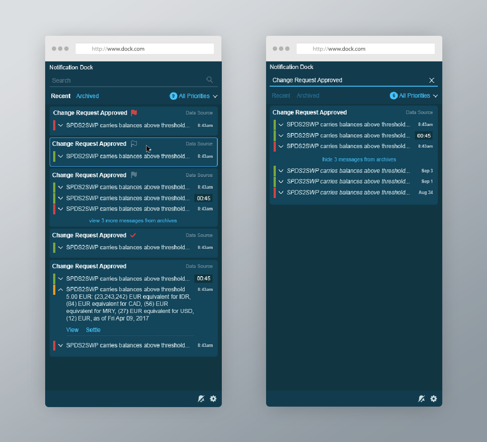
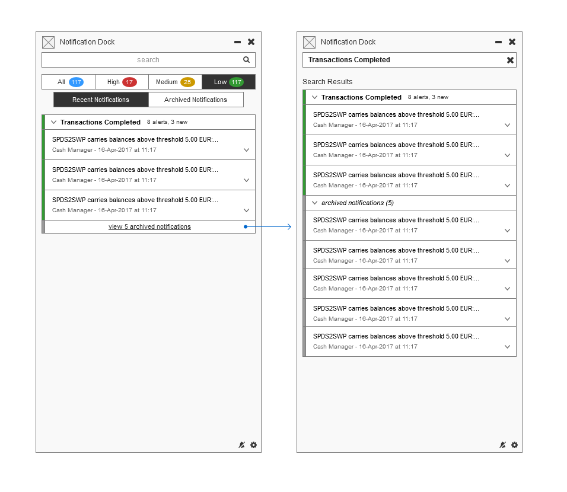
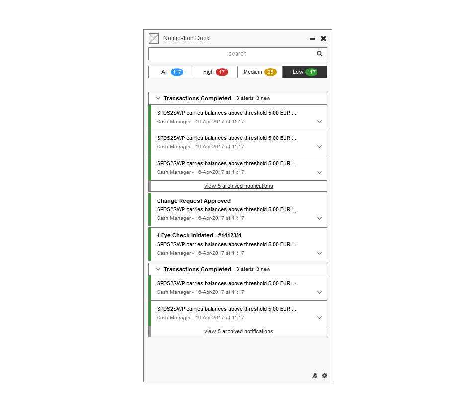
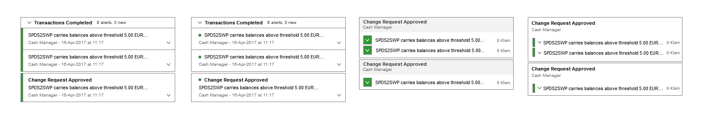
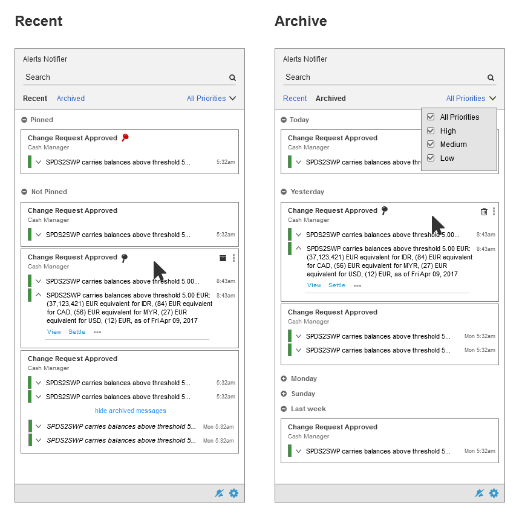
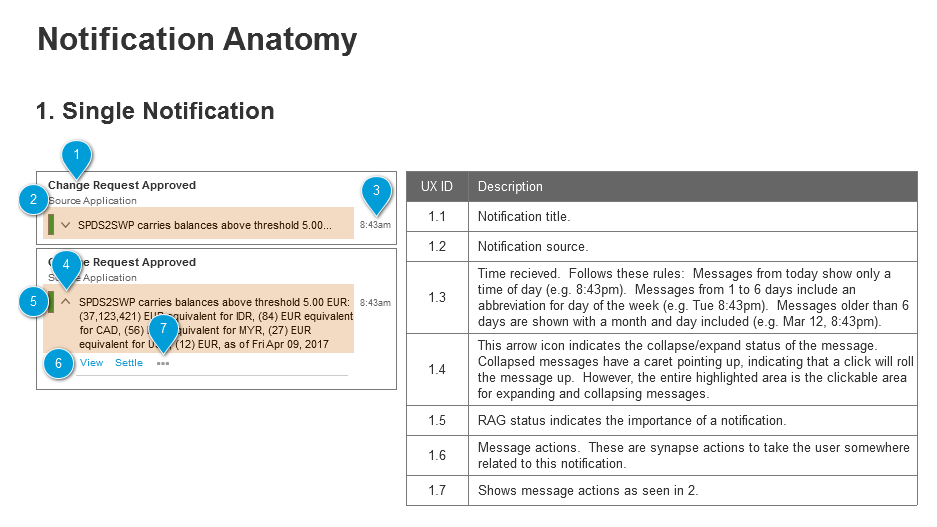

Notification Dock is a platform-wide solution for notifying users from all of their applications.  The primary goal is to unify notifications in a convenient and manageable tool.

## The process

As the lead UXD on the project, I took the Dock through the full UX design process, including user research, wireframing, prototyping, user testing, development support, and iteration.

<figcaption>The redesigned notifcation dock.</figcaption>

## User research

The Dock was challenging because there was an existing user-base, but they were not the primary target audience, so I needed to balance their existing needs with the anticipated needs of the upcoming users.

To do this, I conducted my research first with existing users, to solidify the mandatory requirements, then presented these as examples and basic features for upcoming users to build on.  In many cases, the upcoming users did not fully understand how the tool would be integrated into their daily work, meaning that many features were exploratory.

The primary delivery was a breakdown of projected user demographics, and how the users related to a list of desired features.

## Wireframes

The stakeholders and I went through multiple iterations of wireframes before being satisfied with the offering.

<figcaption>The first round of wireframes added archives and RAG status sorting.</figcaption>

One major issue with the original design for grouping notifications by subject, which was a critical requirement, was that it reduced the scan-ability of notifications, especially when groups mixed with singles.

<figcaption>It's hard to tell where the groups begin and end.</figcaption>

<figcaption>The final layout took a few iterations.</figcaption>

The long priority status bars on the left were causing the notifications to blend, so I started by changing to a smaller indicator.  Then moving the source in with the subject helped reduce the overall size and visual complexity.

After rearranging the notifications, I refined and condensed the controls on the top of the notifier, including recent/archive, priorities, and search.

<figcaption>Condensing the visual complexity gives more room and attention for notifications.</figcaption>

<figcaption>Outlining the anatomy of each notification group.</figcaption>

## High fidelity designs

Following the wireframes, my plan was to put together a fully functional prototype, so I needed a high fidelity design to follow.  The design language is derived from a next generation concept for the Command Center, where users keep their relevant applications.

<figcaption>High fidelity designs added extra visual cues to increase the usability of the Dock.</figcaption>

## Creating a prototype

To facilitate user testing, I decided to create a full prototype, using mock data in an AngularJS application.  Essentially all major features were present and refined, although limited by lack of data services.

## User testing

When testing users, we allowed them to explore the prototype on their own, then asked questions to lead them where we wanted, in order to observe their interactions.  Through this process, patterns emerged about desired changes and additions.

Some examples were:

- Recent notifications are from top-day
- Users need to quickly dismiss notifications
- Users need bulk actions
- Users want to forward notifications
- Flag denotes priority, pin denotes "save for later"

## Product results

The resulting Notification Dock is currently widely used by internal and external people across the platform.  As a result, applications can rely on this golden source system, instead of developing a derivative notification functionality, and users can quickly access notifications from all relevant sources.
