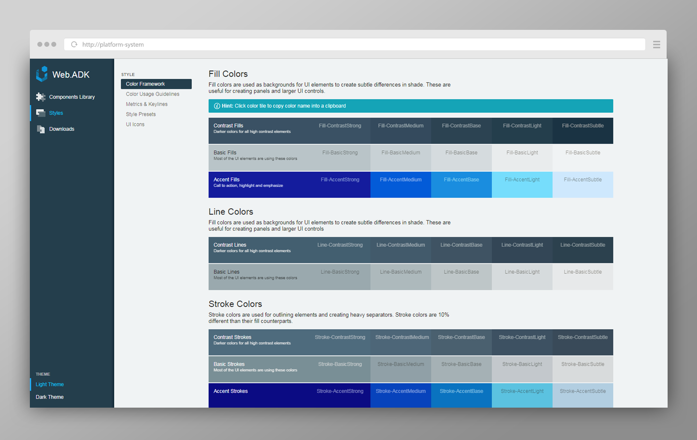

The platform design system seeks to add consistency to all apps across the platform, in both visual styling and user experience.

<figcaption>The design system provides styles, guidance, and a community of application developers</figcaption>

## The Process

Working with two other designers, the project consisted of technical research, exploratory high fidelity design, and CSS/SASS implementation, as well as the development and maintenance of a design system website.

### Technical Research

Before starting, we needed to understand how to build a system that projects would willingly and easily adopt. After debating with many development teams, we settled on using Bootstrap 4, and prioritizing Javascript flexibility by not depending on a framework.

The project would consist of multiple packages.

- Core styles
- Data grid styles
- Data visualization styles
- Community supported javascript packages

We also decided to support multiple themes, primarily light and dark, and the ability to use both simultaneously. This required a careful approach to managing our SASS implementation.

<figcaption>Teams can access the project in many different ways, reducing friction for adoption.</figcaption>

### Exploratory High Fidelity Design

Next, we needed to decide on a design aesthetic, which proved to be challenging due to the inherent subjectiveness and the high number of influences. Ultimately, the result was a combination of recent design languages from several domains, plus a refresh in color, to play nicely with the light and dark themes.

### CSS / SASS Implementation

Our project basically extended bootstrap with some major additions and some minor tweaks. Major additions were the color framework, primarily developed by my co-worker, and some custom html components like application panels and "loading" displays.

The color framework allowed us to style each element only once, but by changing the definition of its variables, switch between unlimited themes.

<figcaption>The color framework uses the same sets of color definitions to style multiple themes.</figcaption>

### Building a Community

To build a community, we had to create a website to show off the system and to provide usage guides. The website was built by the designers using a static webpage engine called [hexo.io](https://hexo.io/). The website styling came mostly from the core package.

## Project Outcome

This project was a huge learning opportunity for me, and the results have been adopted successfully by 4 teams in its first month of release. There is much to be done regarding the community, and distributing support for the system among other subject matter experts.
