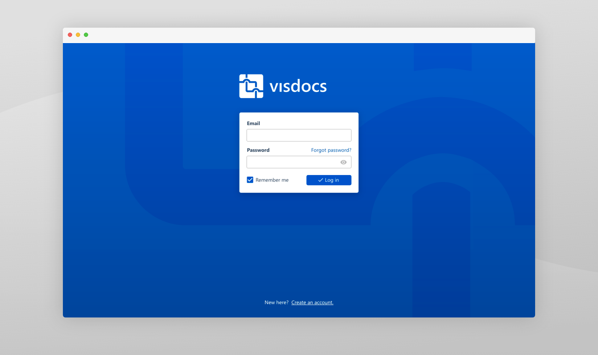

Managing IT assets is hard work, which means that troubleshooting IT mishaps is often a complicated mess. Visdocs provides a structured way to document networks, phone systems, servers and more, providing valuable insight to users.

<!-- end -->

## The process

As the founding UX and UI designer (and frontend engineer), my goal was to go from nothing to something game-changing. Working alongside experts and up-and-comers in the industry, we developed a feature-set to solve 3 primary problems, and then brought those features through wireframes, visual design, and technical implementation.

 Visdocs' login screen

## User research

In order to begin designing a system that would structure complex documentation, I first needed to understand the subject.

A common structure for IT troubleshooting teams is a three-tiered approach consisting of what I call: Help Desk, Service Technicians, and Focused Experts. Help Desk is the broadest area, screening all calls and tickets, picking low handing fruit, and funneling more advanced tasks to the appropriate Service Technician. Each Service Technician is responsible for several areas and are the work-horses that solve most tickets. When a tricky problem comes up, it gets escalated to the appropriate Focused Expert, who acts as the final line of defense.

My research consisted of interviewing and shadowing each tier, to learn what a normal day looks like, and where the pain points exist. Of course, each tier experienced different pain points. Compiling the results of these studies provided the following targets:

- Search: Help Desk should either solve the problem immediately or move on. The largest facilitator of quick solutions was searching previously solved tickets.
- Monitoring: Service technicians are constantly working under a backlog. To prevent maintenance tasks from bubbling into show-stopping issues, they need efficient monitoring and moderation of assets.
- Visual Representation: Focused Experts won't find solutions lying about in an old article or ticket. Creating mental models of complex relationships expedites identifying potential trouble.
