Managing IT assets is hard work, which means that troubleshooting IT mishaps is often a complicated mess. Visdocs provides a structured way to document networks, phone systems, servers and more, providing valuable insight to users.

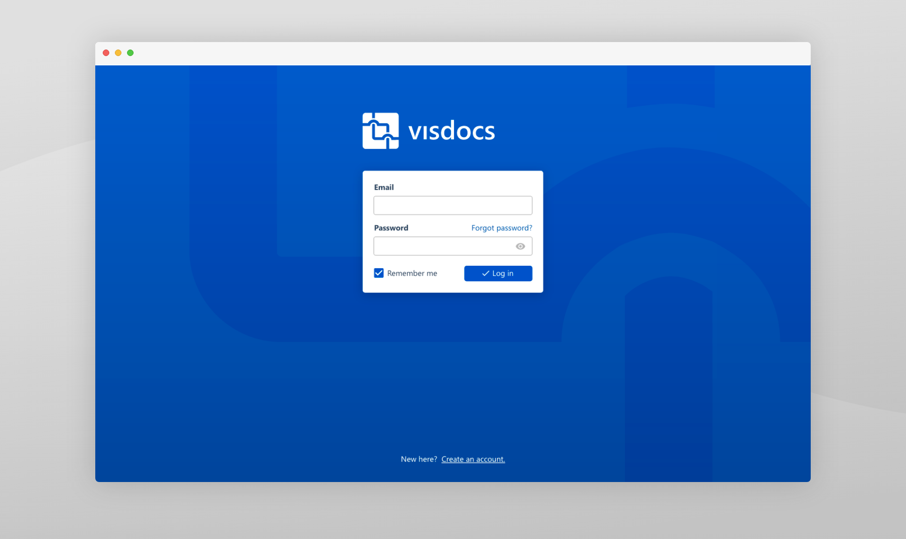

## The Process

As the founding UX and UI designer (and frontend engineer), my goal was to go from nothing to something game-changing. Working alongside experts and up-and-comers in the industry, we developed a feature-set to solve critical problems and then brought those features through wireframing, visual design, and implementation.

## User Research

In order to begin designing a system that would structure complex documentation, I first needed to understand the subject.

A common strategy for IT troubleshooting teams is a three-tiered approach consisting of what I call: Help Desk, Service Technicians, and Focused Experts. Help Desk is the broadest area, screening all calls and tickets, picking low handing fruit, and funneling more advanced tasks to the appropriate Service Technician. Each Service Technician is responsible for several areas and are the work-horses that solve most tickets. When a tricky problem comes up, it gets escalated to the appropriate Focused Expert, who acts as the final line of defense.

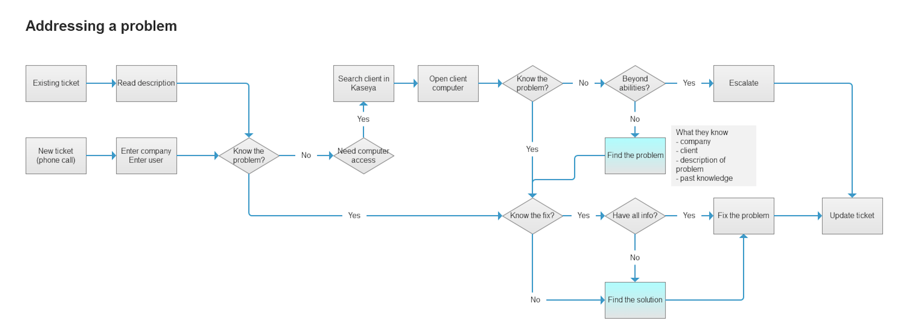

<figcaption>One of many user flows demonstrating how tickets are resolved.</figcaption>

My research consisted of interviewing and shadowing each tier to learn what a normal day looks like, including its pain points. Of course, each tier experienced different pain points. Compiling the results of these studies provided the following targets:

- Search: Help Desk should either solve the problem immediately or move on. The largest facilitator of quick solutions was searching previously solved tickets.
- Monitoring: Service technicians are constantly working under a backlog. To prevent maintenance tasks from bubbling into show-stopping issues, they need efficient monitoring and moderation of assets.
- Visual Representation: Focused Experts won't find solutions lying about in an old article or ticket. Creating mental models of complex relationships expedites identifying potential trouble.

## Data Organization

I developed two approaches to data organization, which I called "Objects Through Views" and "Views Through Objects".

With the "Objects Through Views" approach, users choose the view first and then choose what objects to view in the chosen context. The three primary views were data grid, visual diagram, and detail pane. This approach provided a flexible UI, which enabled users to simultaneously view related data from separate modules, such as a server, its network diagram, and an article related to that server's OS.

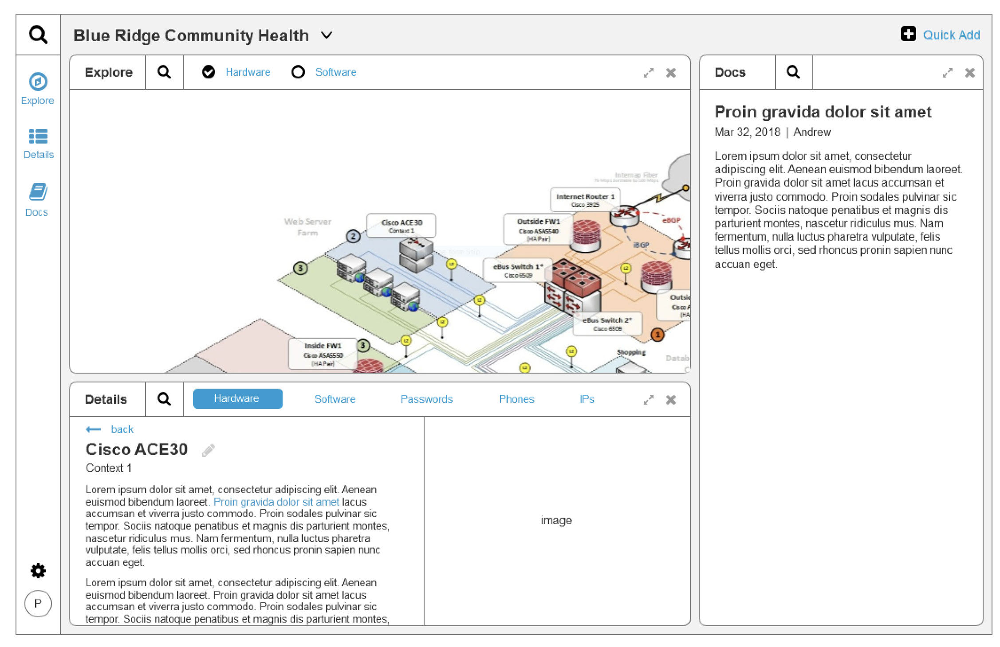

<figcaption>Objects Through Views</figcaption>

With "Views Through Objects", users decide what objects to view first and then choose how to view those objects, using the same three view methods. This approach prioritized choosing a module first, meaning that users could quickly indicate to the system what information they were looking for.

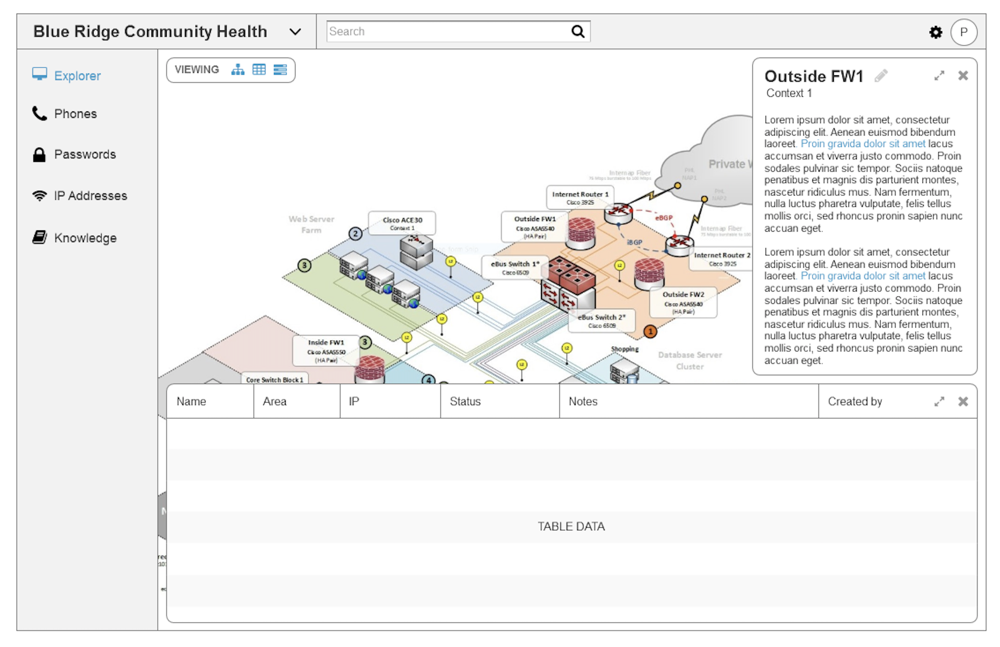

<figcaption>Views Through Objects</figcaption>

Through user testing, I concluded that "Views Through Objects" was more familiar when compared with other industry tools and would have a lower learning curve.

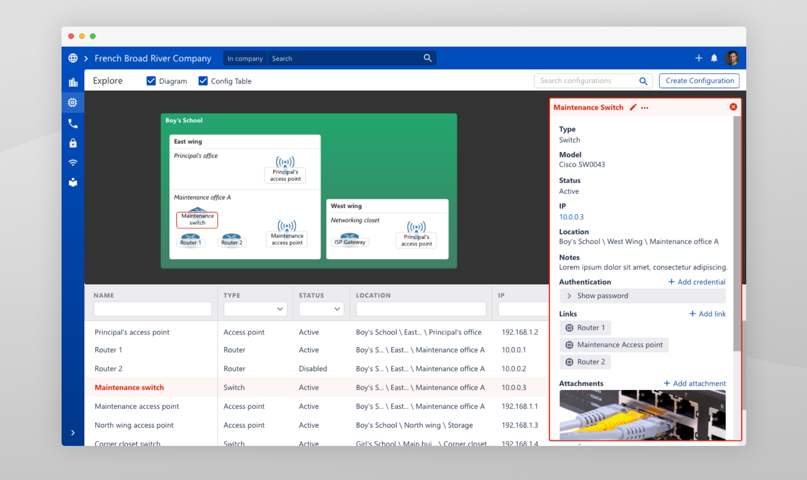

<figcaption>Hi-fidelity design of Views Through Objects.</figcaption>

## Wireframes

Visdocs is a vast product, so for sanity, I will share a few wireframes and the decisions around them.

### Template Builder

The template builder allowed admins to customize the data fields attached to each type of asset. For instance, admins might create a new type of asset called webcam and add a field called "Installed By" where a tech could be designated at the creation of each webcam.

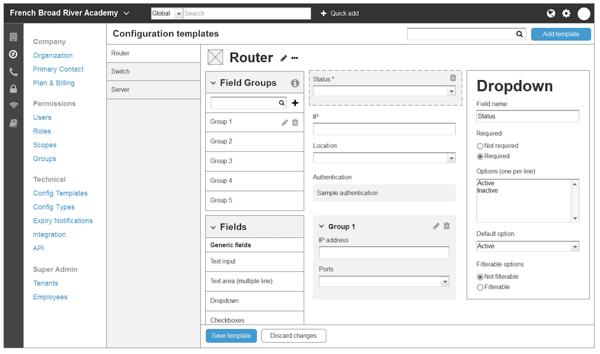

<figcaption>Template builder wireframe.</figcaption>

The primary decision to be made was how templates are applied to assets. We came up with three options:

- Assets have one template. Templates have one-or-many tags, later named "field groups".
- Assets have one template. Templates can extend other templates.
- Assets have one-or-many templates. Templates have fields.

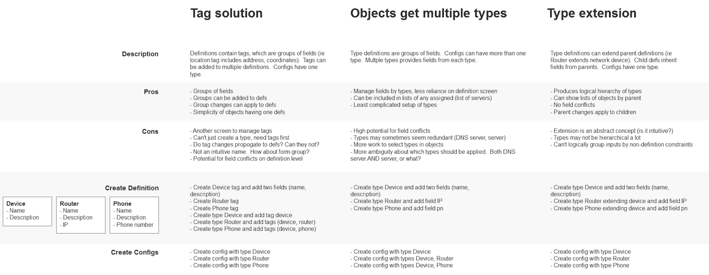

<figcaption>Matrix to decide how templates relate to assets.</figcaption>

To solve this problem, I looked at competitors, modeled real assets and their ideal templates to determine viability, and talked to users about which solution was most intuitive.

Research indicated issues around assets having multiple templates, where more than one template specified the same field, or worse, different fields intending to represent the same data.

Template extension seemed promising, but building a complex set of templates would have resulted in a fragile tree of dependencies.

Field groups were flexible, easy to understand, and instinctive, considering the complexity of the problem, especially with a sleek UI consisting of drag-n-drop capability and the capacity to view field configurations alongside the form builder.

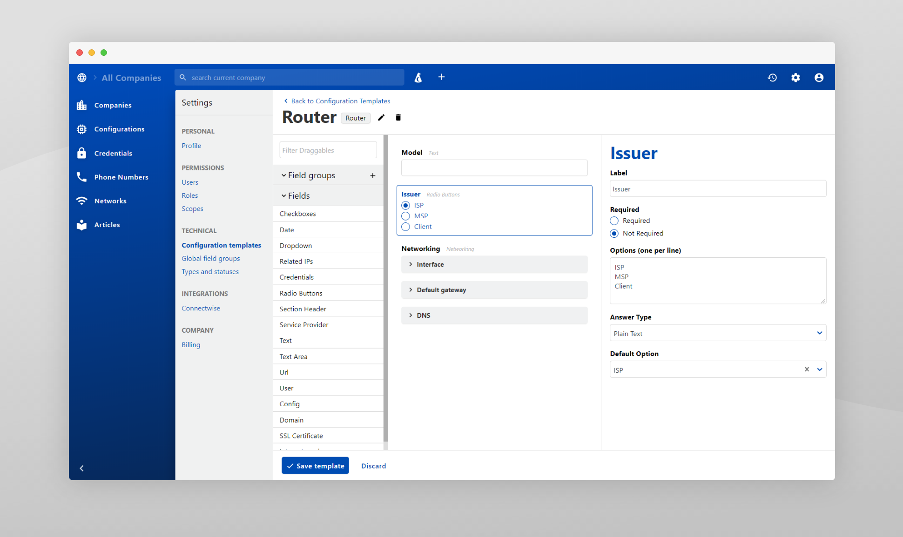

<figcaption>Final design for template builder.</figcaption>

### Networks

Competing applications had loose concepts for networking, where unstructured data made it impossible for them to connect the dots between related assets.

Our networks are robust, using real-world models to represent relationships in such a way that the big picture of each network can be filled in automatically.

To represent this, we needed an intuitive way to show IP addresses and related assets from the network side and the asset side.

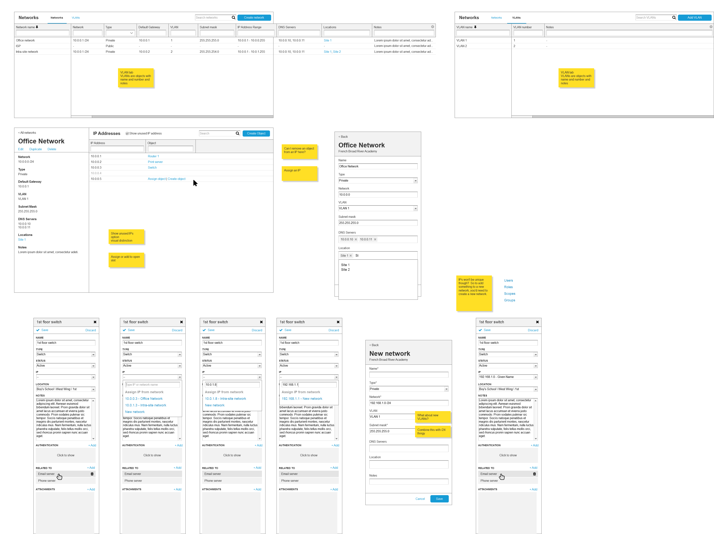

<figcaption>Wireframe for the networks module.</figcaption>

From looking not at documentation competitors, but network management tools, like Cisco Meraki and FortiNet, we determined that the key was for users to see existing IP addresses with relationships _and_ potential IP addresses where relationships could exist in the future.

From the asset side, things were just as critical, since assignments to the network were frequently made during asset creation.

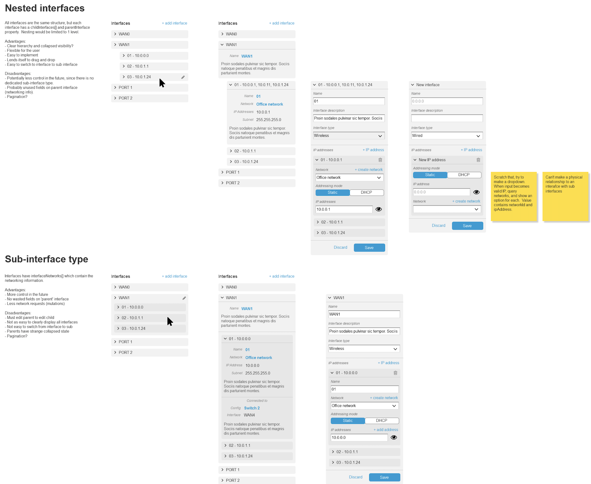

<figcaption>Interfaces are ports on a device.</figcaption>

Ultimately, devices had two methods of choosing a network and IP address, one could be done quickly through search, and the other done visually with more confidence.

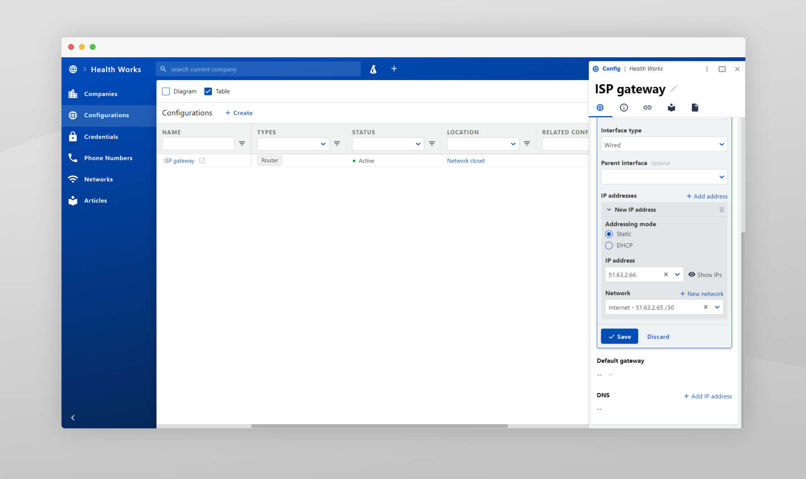

<figcaption>Final design for config interfaces.</figcaption>

## Visual Design

Our primary competitor, [IT Glue](https://www.itglue.com/), has a rather stale and gloomy appearance, and an equally gloomy PR outlook among customers in the industry. My goal was to create a refreshing new take, requiring lively colors.

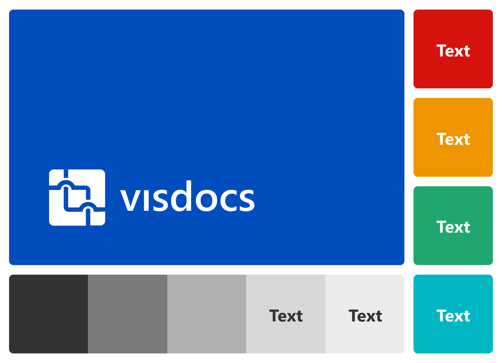

When doing visual design, I tend to prioritize usability and function over aesthetics, especially when working with a powerful application. When given the choice between larger margins and expansive shadows or tight margins and expansive data, I'll commonly lean towards expansive data.

Good visual design is about making powerful interfaces appear simple. It's easy to make simple interfaces appear simple, but breaking down complex features requires finesse and endless tweaking through user feedback.

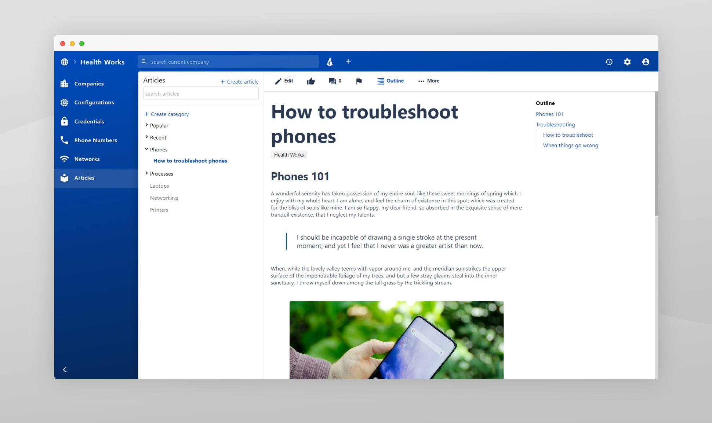

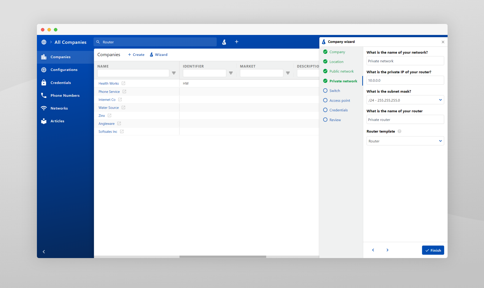

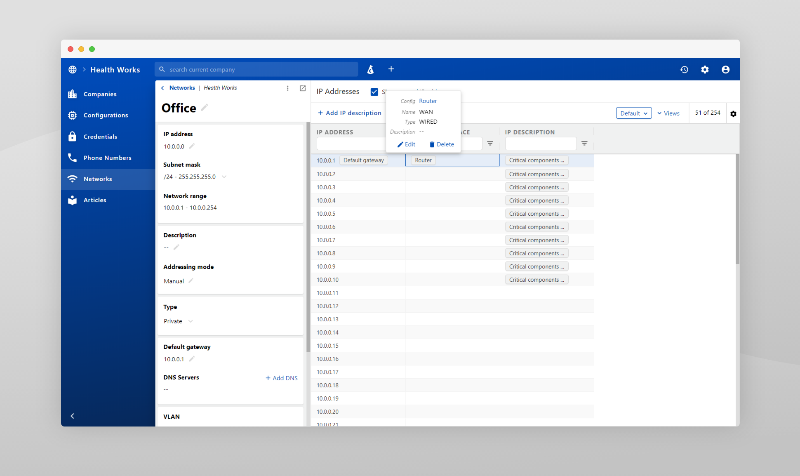

## Implementation

As UX started tapering off, I switched into hybrid mode, ultimately doing mostly software development by the end of the project. We were a small team of 3, and after the first few months, I was the sole UI developer for the entire application.

Working as a developer and designer is hard, because development is easier to prioritize, and design can get moved to the back-burner. Fortunately, I had a solid foundation to expedite the design phase in subsequent iterations, which included a robust component library for all reusable building blocks, making high fidelity designs less important than research and wireframes.

The UI is built using the following technologies:

- React
- Redux / Epics
- Apollo / GraphQL
- Jest / Cypress
- RxJs
- Formik
- react-select
- and many more fantastic open source projects

## Project Outcome

Visdocs is currently on hold as another product is being built, which will enable a more automated approach to populating Visdocs' documentation.

When the automation product is completed, Visdocs will finish strong and hopefully drive the market toward more innovative and powerful solutions.

In the meantime, Visdocs is being beta-tested by an MSP, which has touted its usefulness in documenting networked assets.
